# Blast Mail 사용자 가이드

<!-- START doctoc -->
<!-- END doctoc -->

---

## 1. 로그인

Blast Mail에 접속하면 로그인 화면이 나타납니다.

- **아이디**: 관리자가 생성한 계정의 사용자명을 입력합니다.
- **비밀번호**: 계정 비밀번호를 입력합니다.
- **SSO 로그인**: OAuth가 설정된 경우 SSO 로그인 버튼이 표시됩니다.

> 초기 관리자 계정: `admin` / `admin` (로그인 후 반드시 비밀번호를 변경하세요)

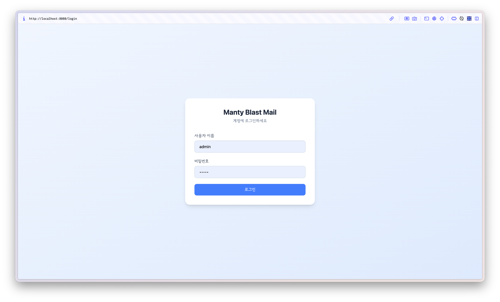

---

## 2. 대시보드

로그인 후 가장 먼저 보이는 화면입니다. 캠페인 현황을 한눈에 파악할 수 있습니다.

#### 통계 카드

| 항목 | 설명 |
|------|------|
| 전체 캠페인 | 생성된 캠페인 총 수 |
| 발송 성공 | 성공적으로 발송된 이메일 수 |
| 발송 실패 | 발송에 실패한 이메일 수 |
| 성공률 | 전체 발송 대비 성공 비율 (%) |

#### 차트 및 최근 캠페인

- **막대 차트**: 최근 캠페인별 발송 성공/실패 수를 시각화합니다.
- **최근 캠페인 목록**: 캠페인 이름, 상태, 발송/실패/수신자 수, 생성일을 표시합니다. 행을 클릭하면 해당 캠페인 상세 페이지로 이동합니다.

> 관리자(admin)는 전체 통계를, 일반 사용자는 자신이 생성한 캠페인 통계만 볼 수 있습니다.

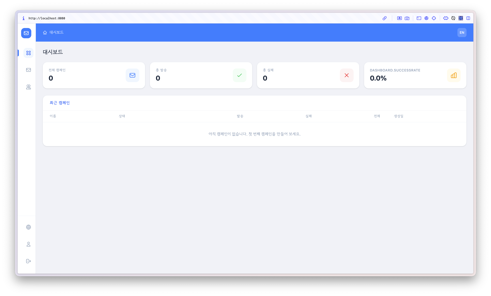

---

## 3. 캠페인 관리

### 3.1 캠페인 목록

사이드바에서 캠페인 메뉴를 클릭하면 캠페인 목록을 확인할 수 있습니다.

| 컬럼 | 설명 |
|------|------|
| # | 캠페인 ID |
| 생성자 | 캠페인을 만든 사용자 |
| 캠페인명 | 캠페인 이름 |
| 제목 | 이메일 제목 |
| 상태 | draft / ready / sending / paused / completed / cancelled |
| 성공 | 발송 성공 수 |
| 실패 | 발송 실패 수 |
| 수신자 | 전체 수신자 수 |
| 생성일 | 캠페인 생성 날짜 |

- 우측 상단의 **"+ 새 캠페인"** 버튼으로 새 캠페인을 생성합니다.
- 행을 클릭하면 캠페인 상세 페이지로 이동합니다.
- 하단 페이지네이션으로 목록을 탐색합니다.

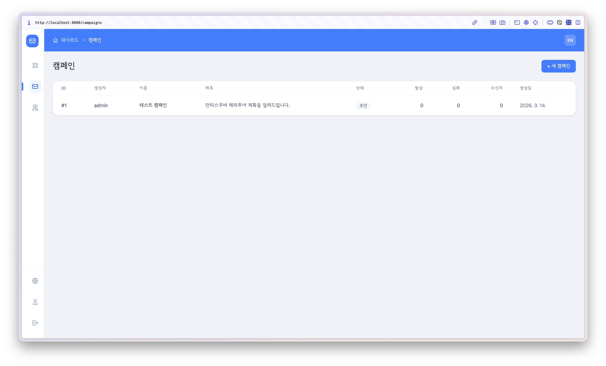

### 3.2 캠페인 생성

**"+ 새 캠페인"** 버튼을 클릭하면 캠페인 생성 폼이 나타납니다.

| 필드 | 필수 | 설명 |
|------|------|------|
| 캠페인명 | O | 캠페인을 구분하는 이름 |
| 제목 | O | 이메일 제목 |
| 발신자 이름 | O | 수신자에게 표시될 발신자 이름 |
| 발신자 이메일 | O | 발신 이메일 주소 |

**"캠페인 생성"** 버튼을 클릭하면 캠페인이 생성되고 상세 페이지로 이동합니다.

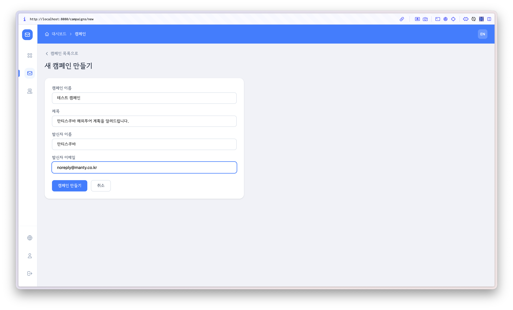

### 3.3 캠페인 상세

캠페인의 중앙 관리 화면입니다. 상단에 캠페인 이름, 상태, 수신자 수가 표시됩니다.

#### 상단 액션 버튼

| 버튼 | 설명 |
|------|------|
| 초안으로 되돌리기 | 완료/취소된 캠페인을 다시 초안(draft) 상태로 변경 |
| 작성 | 이메일 본문 편집 페이지로 이동 |
| 발송 | 발송 페이지로 이동 |
| 리포트 | 발송 결과 리포트 페이지로 이동 |

#### 캠페인 정보 탭

캠페인명, 제목, 발신자 이름, 발신자 이메일을 수정하고 **"저장"** 버튼으로 저장합니다.
**"캠페인 삭제"** 버튼을 클릭하면 확인 대화상자 후 삭제됩니다.

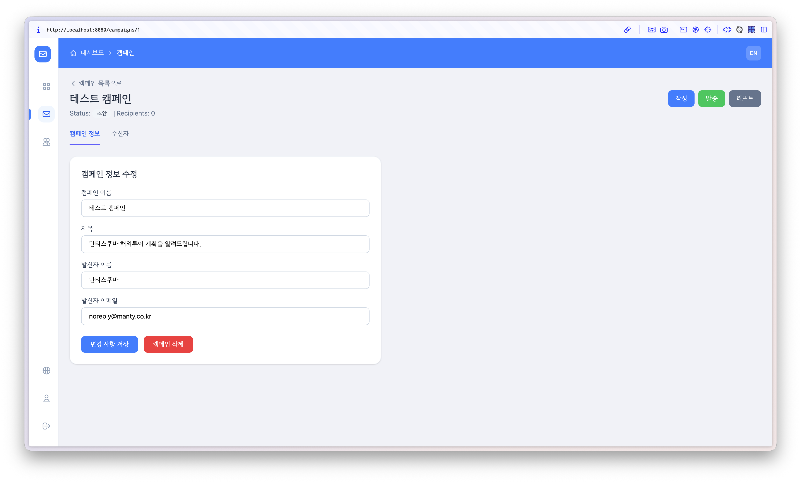

#### 수신자 탭

수신자를 등록하고 관리하는 탭입니다.

**CSV 업로드 (좌측)**

1. **"템플릿 다운로드"** 버튼으로 CSV 샘플 파일을 다운로드합니다.
2. CSV 또는 XLSX 파일을 드래그 앤 드롭하거나 클릭하여 업로드합니다.
3. CSV 형식: `email,name` (헤더 포함, 추가 컬럼은 변수로 사용 가능)

**수동 입력 (우측)**

| 필드 | 필수 | 설명 |
|------|------|------|
| 이메일 | O | 수신자 이메일 주소 |
| 이름 | X | 수신자 이름 |
| 변수 | X | 템플릿에서 사용할 커스텀 변수 (키-값 쌍) |

**"+ 변수 추가"** 버튼으로 커스텀 변수를 추가할 수 있습니다.

**수신자 목록**

- 검색창으로 수신자를 필터링할 수 있습니다.
- 각 수신자의 이메일, 이름, 변수, 상태(pending/sent/failed/skipped)를 확인합니다.
- 개별 삭제(X 아이콘) 또는 **"전체 삭제"** 버튼으로 수신자를 삭제합니다.

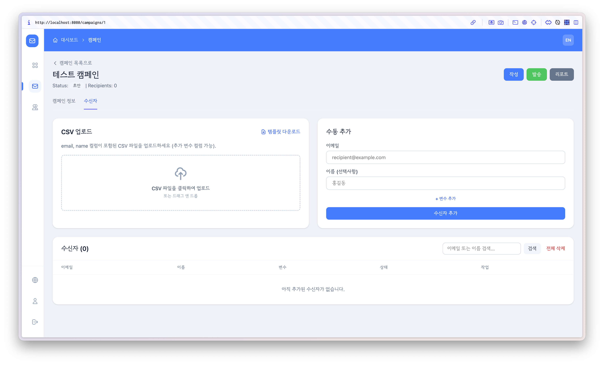

---

## 4. 이메일 작성 (Compose)

캠페인 상세에서 **"작성"** 버튼을 클릭하면 이메일 편집 페이지로 이동합니다.

### 4.1 편집 모드

**HTML 모드** (기본)

리치 텍스트 에디터(TipTap)로 이메일을 작성합니다. 툴바 기능:

| 기능 | 설명 |
|------|------|
| B / I / U | 굵게, 기울임, 밑줄 |
| H1 / H2 / H3 | 제목 크기 |
| 링크 | URL 링크 삽입 |
| 이미지 | 외부 이미지 URL 삽입 |
| 목록 | 번호/글머리 기호 목록 |
| 정렬 | 좌/중/우 정렬 |
| 텍스트 색상 | 글자 색상 변경 |
| 표 | 테이블 삽입 |
| 구분선 | 수평 구분선 |
| 실행취소/다시실행 | Undo / Redo |

**Raw MIME 모드**

MIME 형식으로 직접 이메일 원문을 작성합니다. 멀티파트 메일이나 고급 설정이 필요한 경우 사용합니다.

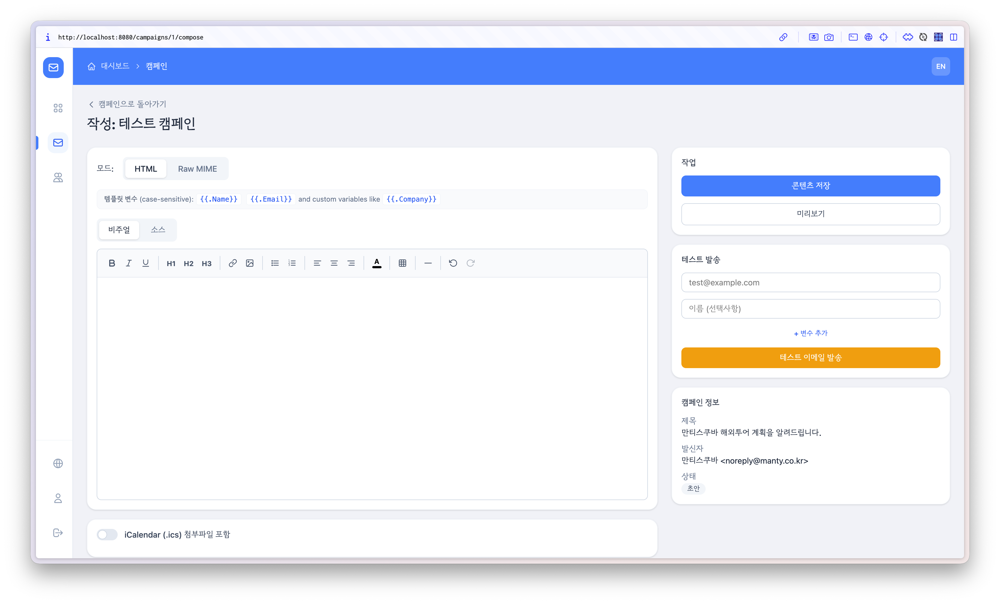

### 4.2 템플릿 변수

이메일 본문에서 다음 변수를 사용할 수 있습니다:

| 변수 | 설명 |
|------|------|
| `{{.Name}}` | 수신자 이름 |
| `{{.Email}}` | 수신자 이메일 |
| `{{.변수키}}` | 수신자별 커스텀 변수 (CSV 열 이름의 첫 글자가 대문자로 변환) |

> 변수명은 대소문자를 구분합니다.

### 4.3 iCalendar 첨부 (선택)

HTML 모드에서 **"iCalendar (.ics) 첨부 포함"** 체크박스를 선택하면 캘린더 일정 첨부 기능이 활성화됩니다.

| 필드 | 설명 |
|------|------|
| 일정 제목 | 캘린더에 표시될 일정 이름 |
| 시작 일시 | 일정 시작 날짜/시간 |
| 종료 일시 | 일정 종료 날짜/시간 |
| 장소 | 일정 장소 |
| 설명 | 일정 상세 설명 |
| 주최자 이름 | 주최자 이름 |
| 주최자 이메일 | 주최자 이메일 주소 |

> `{{.Email}}`을 참석자 필드에 사용하면 수신자별로 자동 초대됩니다.

Builder 모드와 Raw 모드를 전환할 수 있으며, Builder 모드에서 작성한 내용은 ICS 미리보기로 확인할 수 있습니다.

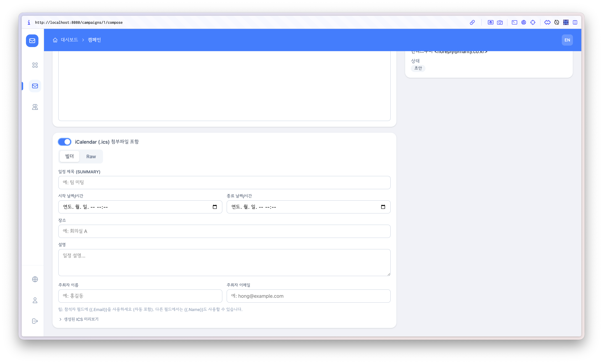

### 4.4 미리보기 및 테스트 발송

**우측 사이드바:**

- **"저장"** 버튼: 작성한 내용을 저장합니다.
- **"미리보기"** 버튼: 이메일 미리보기를 모달 창으로 확인합니다.

**테스트 발송:**

| 필드 | 설명 |
|------|------|
| 테스트 이메일 | 테스트를 받을 이메일 주소 |
| 테스트 이름 | (선택) 테스트용 이름 |
| 커스텀 변수 | (선택) 테스트용 변수 값 |

**"테스트 이메일 발송"** 버튼으로 실제 이메일을 발송하여 결과를 확인합니다.

> 테스트 발송 전에 반드시 내용을 먼저 저장해야 합니다.

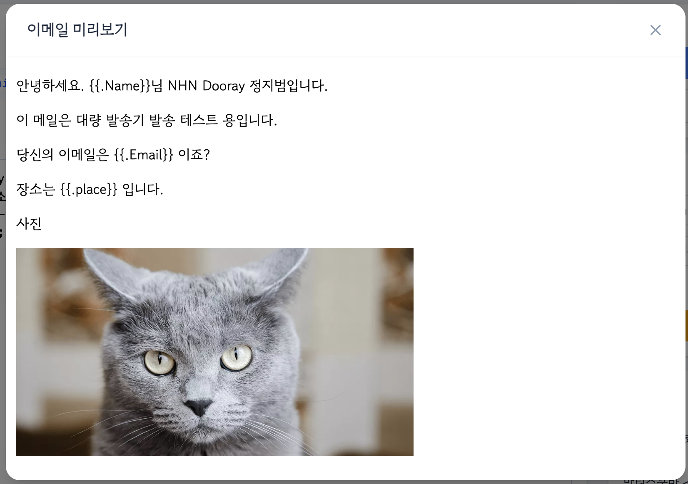

---

## 5. 발송

캠페인 상세에서 **"발송"** 버튼을 클릭하면 발송 페이지로 이동합니다.

### 5.1 실시간 모니터링

- **연결 상태**: 우측 상단에 실시간 연결 상태(Live/Offline)가 표시됩니다.
- **진행률 바**: 전체 발송 진행률을 퍼센트와 수치(X / Y)로 표시합니다.
- **통계 카드**: 발송 성공, 실패, 남은 수, 현재 발송 속도를 실시간으로 갱신합니다.

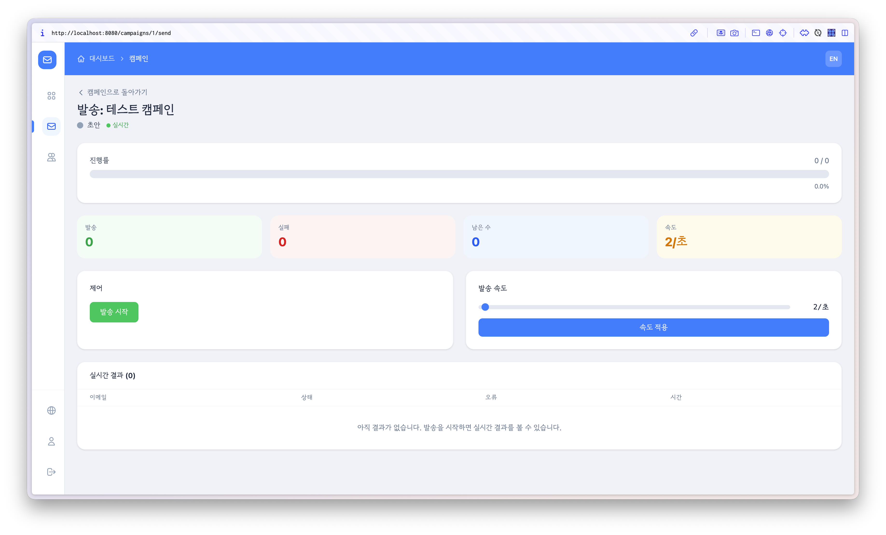

### 5.2 발송 제어

| 상태 | 사용 가능한 버튼 |
|------|-----------------|
| draft / ready | **발송 시작** (초록) |
| sending | **일시정지** (주황) |
| paused | **재개** (초록), **취소** (빨강) |
| completed / cancelled | **리포트 보기** |

취소 시 확인 대화상자가 나타납니다.

### 5.3 발송 속도 조절

- 슬라이더로 초당 발송 수를 1~100 사이에서 조절합니다.
- **"속도 적용"** 버튼을 클릭하면 실시간으로 발송 속도가 변경됩니다.

### 5.4 실시간 결과

WebSocket을 통해 발송 결과가 실시간으로 테이블에 표시됩니다:

| 컬럼 | 설명 |
|------|------|
| 이메일 | 수신자 이메일 주소 |
| 상태 | sent (초록) / failed (빨강) |
| 오류 | 실패 시 오류 메시지 |
| 시간 | 발송 시각 |

최근 200건까지 자동 스크롤로 표시됩니다.

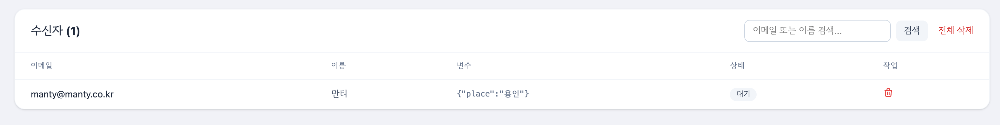

---

## 6. 리포트

캠페인 상세 또는 발송 완료 후 **"리포트"** 버튼을 클릭하면 발송 결과를 확인할 수 있습니다.

### 6.1 통계 요약

| 항목 | 설명 |
|------|------|
| 발송 성공 | 성공적으로 발송된 수 |
| 발송 실패 | 실패한 수 |
| 전체 수신자 | 총 수신자 수 |
| 성공률 | 성공/전체 비율 (%) |

### 6.2 파이 차트

발송 성공/실패 비율을 도넛 차트로 시각화합니다.

### 6.3 발송 로그

| 컬럼 | 설명 |
|------|------|
| 이메일 | 수신자 이메일 |
| 상태 | sent / failed |
| 오류 메시지 | 실패 시 오류 내용 |
| 발송 시각 | 이메일 발송 시각 |

페이지당 20건씩 페이지네이션으로 탐색합니다.

### 6.4 CSV 내보내기

우측 상단 **"CSV 내보내기"** 버튼을 클릭하면 전체 발송 로그를 CSV 파일로 다운로드합니다.

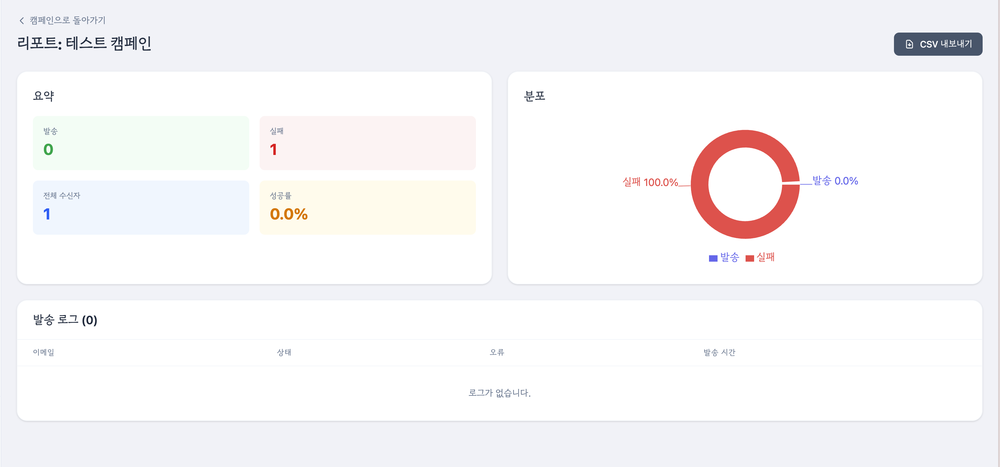

---

## 7. 통합 검색

상단 파란색 헤더바의 **검색창**에 2글자 이상 입력하면 통합 검색이 실행됩니다.

검색 대상:

| 유형 | 아이콘 | 설명 |
|------|--------|------|
| 캠페인 | 파란색 | 캠페인 이름, 제목으로 검색 |
| 수신자 | 초록색 | 수신자 이메일, 이름으로 검색 |
| 감사 로그 | 보라색 | 감사 로그 내용으로 검색 |

검색 결과를 클릭하면 해당 항목의 상세 페이지로 이동합니다.

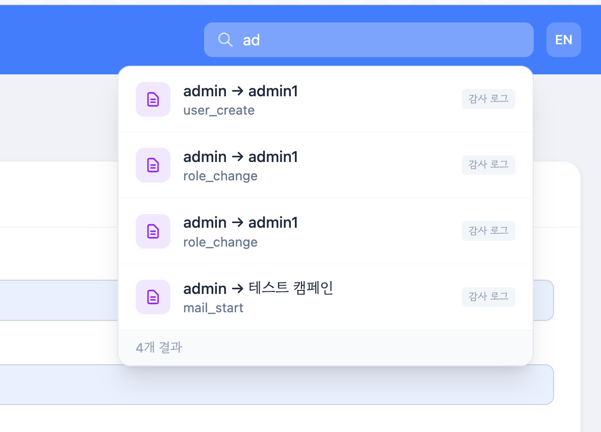

---

## 8. 프로필

사이드바 하단의 **프로필** 아이콘을 클릭하면 계정 정보를 확인하고 비밀번호를 변경할 수 있습니다.

#### 계정 정보

- 사용자명
- 역할 (Admin / User)
- 인증 유형 (SSO인 경우 표시)

#### 비밀번호 변경 (로컬 계정만)

| 필드 | 설명 |
|------|------|
| 현재 비밀번호 | 기존 비밀번호 확인 |
| 새 비밀번호 | 변경할 비밀번호 (4자 이상) |
| 비밀번호 확인 | 새 비밀번호 재입력 |

> SSO(OAuth) 사용자는 비밀번호 변경이 불가합니다.

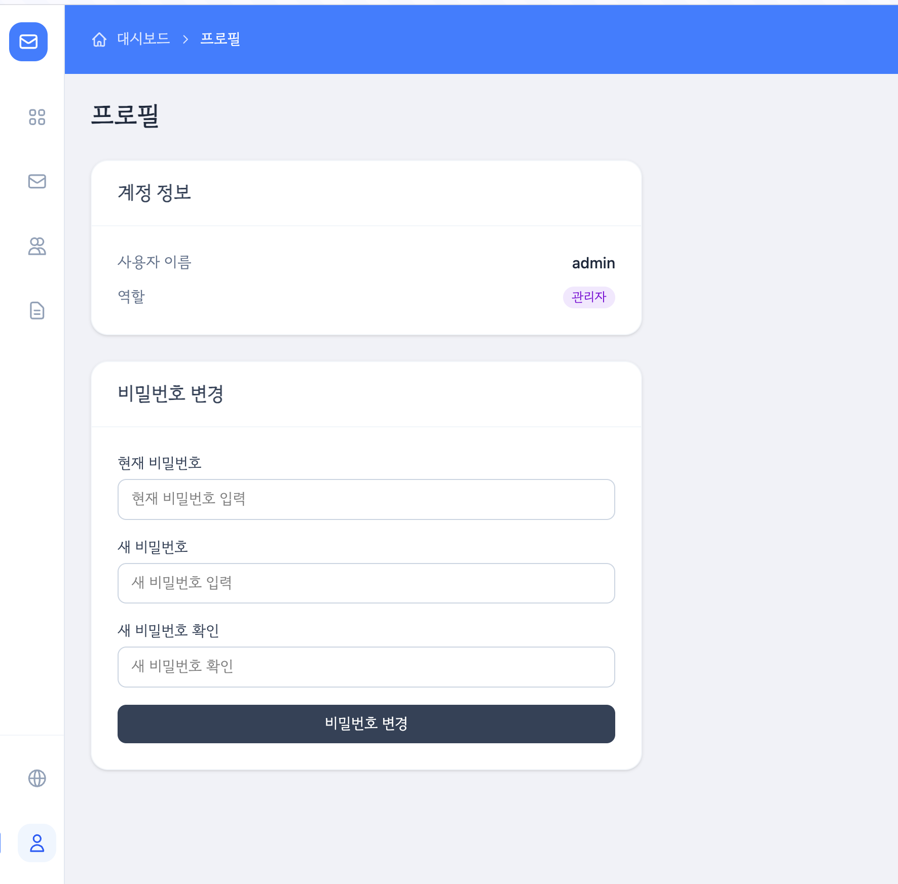

---

## 9. 사용자 관리 (관리자 전용)

사이드바에서 **사용자 관리** 메뉴를 클릭합니다. 관리자(admin) 역할만 접근할 수 있습니다.

### 9.1 사용자 목록

| 컬럼 | 설명 |
|------|------|
| ID | 사용자 ID |
| 사용자명 | 계정 이름 |
| 인증 유형 | Local / SSO |
| 역할 | 역할 뱃지 (클릭하여 변경) |
| 삭제 | 사용자 삭제 |

**역할 변경**: 역할 뱃지를 클릭하면 `pending -> user -> admin -> pending` 순서로 순환합니다.

| 역할 | 설명 |
|------|------|
| pending | 승인 대기 (로그인 후 대기 화면 표시) |
| user | 일반 사용자 (자신의 캠페인만 관리) |
| admin | 관리자 (전체 캠페인, 사용자 관리, 감사 로그 접근) |

### 9.2 사용자 생성

| 필드 | 설명 |
|------|------|
| 사용자명 | 새 계정 사용자명 |
| 비밀번호 | 비밀번호 (4자 이상) |
| 비밀번호 확인 | 비밀번호 재입력 |

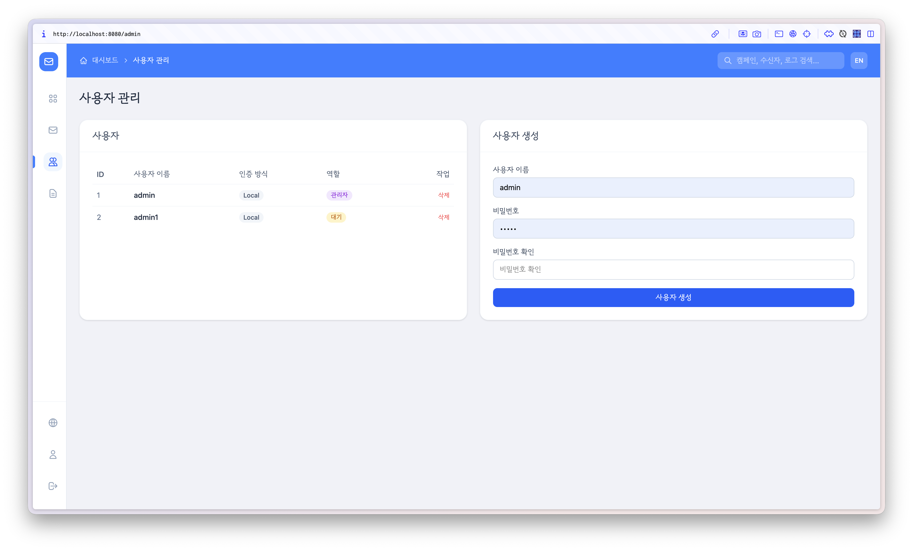

---

## 10. 감사 로그 (관리자 전용)

사이드바에서 **감사 로그** 메뉴를 클릭합니다. 시스템에서 발생한 주요 활동 이력을 확인합니다.

| 컬럼 | 설명 |
|------|------|
| 시간 | 활동 발생 시각 |
| 수행자 | 작업을 수행한 사용자 |
| 작업 | 수행된 작업 유형 |
| 대상 | 작업 대상 (사용자/캠페인) |
| 상세 | 작업 세부 내용 |

#### 작업 유형

| 작업 | 색상 | 설명 |
|------|------|------|
| role_change | 보라색 | 사용자 역할 변경 (이전 -> 변경 역할 표시) |
| mail_start | 파란색 | 메일 발송 시작 (수신자 수 표시) |
| user_create | 초록색 | 새 사용자 생성 |
| user_delete | 빨간색 | 사용자 삭제 |

페이지당 20건씩 표시되며 페이지네이션으로 탐색합니다.

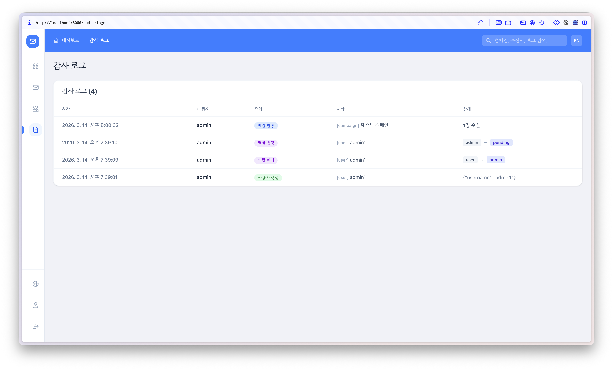

---

## 11. 사이드바 네비게이션

좌측 사이드바는 아이콘 모드(68px)로 기본 표시되며, 마우스를 올리면 확장(200px)되어 메뉴 이름이 나타납니다.

| 메뉴 | 권한 | 설명 |
|------|------|------|
| 대시보드 | 전체 | 통계 및 최근 캠페인 |
| 캠페인 | 전체 | 캠페인 목록 및 관리 |
| 사용자 관리 | admin | 사용자 생성/삭제/역할 관리 |
| 감사 로그 | admin | 시스템 활동 이력 |
| 언어 변경 | 전체 | 한국어/영어 전환 |
| 프로필 | 전체 | 계정 정보 및 비밀번호 변경 |
| 로그아웃 | 전체 | 로그아웃 |

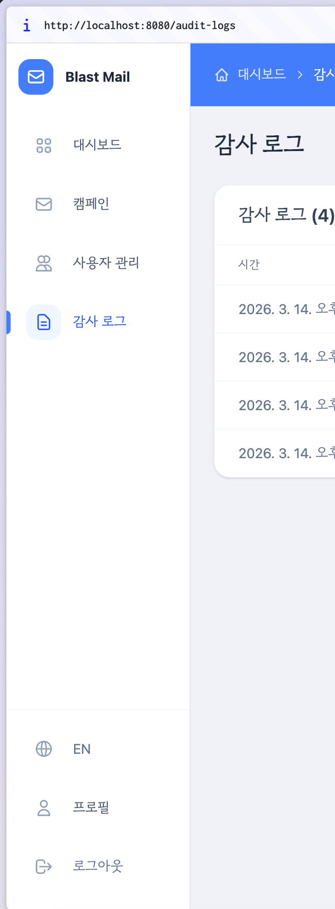

---

## 12. 캠페인 워크플로우 요약

전체 캠페인 발송 과정을 요약하면 다음과 같습니다:

```
1. 캠페인 생성
   +-- 캠페인명, 제목, 발신자 정보 입력

2. 수신자 등록
   +-- CSV/XLSX 파일 업로드
   +-- 수동 입력 (커스텀 변수 포함)

3. 이메일 작성
   +-- HTML 에디터 또는 Raw MIME
   +-- 템플릿 변수 활용 ({{.Name}}, {{.Email}} 등)
   +-- iCalendar 일정 첨부 (선택)
   +-- 미리보기 확인
   +-- 테스트 이메일 발송

4. 발송
   +-- 발송 시작/일시정지/재개/취소
   +-- 실시간 진행률 모니터링
   +-- 발송 속도 조절 (1~100/sec)

5. 리포트 확인
   +-- 통계 요약 및 차트
   +-- 상세 발송 로그
   +-- CSV 내보내기
```

---

## 스크린샷 목록

가이드에 필요한 스크린샷 파일을 `docs/images/` 폴더에 저장해주세요:

| 파일명 | 화면 |
|--------|------|
| `login.png` | 로그인 페이지 |
| `dashboard.png` | 대시보드 (통계 카드 + 차트 + 최근 캠페인) |
| `campaign-list.png` | 캠페인 목록 |
| `campaign-new.png` | 캠페인 생성 폼 |
| `campaign-detail-info.png` | 캠페인 상세 - 정보 탭 |
| `campaign-detail-recipients.png` | 캠페인 상세 - 수신자 탭 |
| `compose-html.png` | 이메일 작성 - HTML 에디터 |
| `compose-ics.png` | iCalendar 설정 화면 |
| `compose-preview.png` | 미리보기 모달 및 테스트 발송 |
| `sending-progress.png` | 발송 진행 화면 (진행률 + 통계) |
| `sending-results.png` | 발송 실시간 결과 테이블 |
| `report.png` | 리포트 (통계 + 차트 + 로그) |
| `search.png` | 통합 검색 결과 드롭다운 |
| `profile.png` | 프로필 / 비밀번호 변경 |
| `admin.png` | 사용자 관리 (목록 + 생성 폼) |
| `audit-logs.png` | 감사 로그 목록 |
| `sidebar.png` | 사이드바 (축소/확장 상태) |
